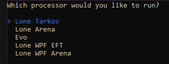

# Tarkov Dumper

A simple and efficient dumper for **Escape from Tarkov** and **Escape from Tarkov Arena**. This tool is designed to help you extract and update game data using **Lone Tarkov**, **Lone Arena**, and **Evo** processors. It ensures all clients are up to date with minimal effort.



## Features
- Supports both **Escape from Tarkov** and **Escape from Tarkov Arena**.
- Utilizes **Unispect** for initial game dumping.
- Processes the dumped data to generate updated offsets.
- Easy-to-use with clear instructions.

## How to Use

1. **Dump the Game**:
   - Use **Unispect** to dump the game data.
   - Save the dump file for processing.

2. **Run the Dumper**:
   - Feed the dump file into the **Tarkov Dumper**.
   - Provide the `Assembly-CSharp.dll` file for the specific game (Tarkov or Arena).

3. **Set Output**:
   - Specify the output directory for the processed files.

4. **Done!**:
   - The dumper will generate the updated files, and you're all set!

## Processors
- **Lone Tarkov**: For Lones EFT client
- **Lone Arena**: For Lones Arena client.
- **Evo**: A universal processor for both games.
- **Lone WPF EFT**: For Lones&x0m WPF based EFT client.

## Requirements
- **Unispect** for initial game dumping.
- **Brain**.

## Installation
1. Clone the repository:
   ```bash
   git clone https://github.com/Butter2222/TarkovDumper.git
